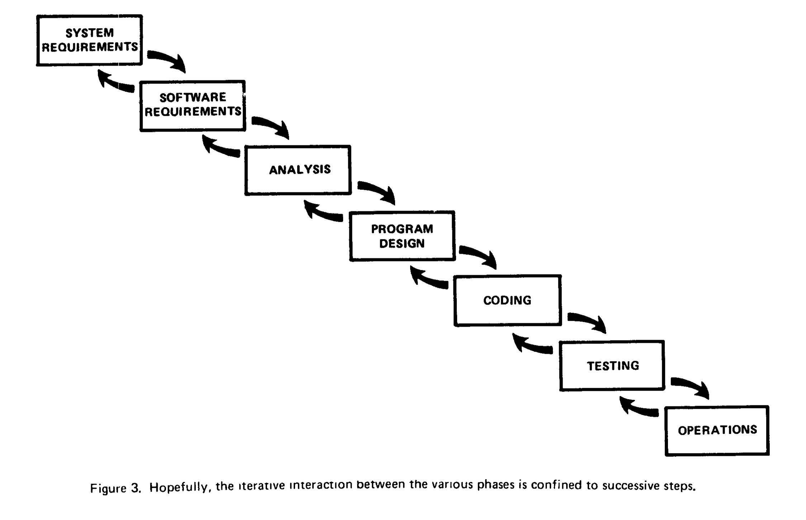

# Why Agile
(Story of a situation where detailled planning doesn’t work.)

> When preparing for battle I have always found that
> plans were useless, but planning was indispensable. 
> <em>—Dwight D. Eisenhower</em>

Some journeys cannot be planned in detail. All we know might be the goal, an improvement or experience we wish to achieve. When preparing for such a trip we try to anticipate some possible obstacles as well as resources that may lie on our way. And we will certainly be prepared to halt from time to time and figure out where we are and where to go next.

Likewise, defining a complex product in its details at that exact point in time when we know least about it – the beginning – is an approach that is obviously flawed. Agility therefore means following a _vision_ while continuously _inspecting and adapting_ our path towards that vision.

## Complexity
There are several models to explain complexity (e. g. [Cynefin][1] or [Structure-Behavior][2]). Let’s think of it as a system that can be understood (to some degree) and described (at least in part), but whose behaviour can never be fully predicted, but the relation between cause and effect can only really be understood in retrospect.

This is different from chaos, in which prediction and systematic understanding is very limited. Chaotic systems are inherently difficult to manage, impossible to replicate and found, for instance, in research environments.

Complexity is also different from order (or complicatedness), in which cause and effect are directly related. Ordered structures are easy to understand an replicate.

## Linear Thinking
Non adaptive systems are like ballistic projectiles: once fired, they follow the laws of physics until they reach (or miss) their target. This precisely describes the effect of the separation of thinking from doing, as implemented in waterfall project organisations.

In 1970, Winston W. Royce presented a model for software development ([PDF][WRR-Waterfall]) which is now referred to as _Waterfall Model_. It describes a sequence of development steps from Systems Requirements all the way down to Operations with transitions only between directly neighbouring phases. 

Royce used it to point out how software development cannot work, but to little avail: Until the dawning of the first agile concepts, basically all software development was based on that same idea: Separating a project into distinct phases, each narrowing the options for all subsequent ones. Almost twenty years in, these ideas are firmly anchored in the majority of organisations including colleges and universities where software engineering and project management continue to be taught as if nothing had happened (_citation needed_). Consequently, as has been [pointed out recently by Dave Thomas][Time-to-kill-agile] – one of the authors of the Agile Manifesto, so-called agile adoptions or agile transitions are often little more than a new process model replacing an old one.

In this linear model, the most important decisions are taken at the beginning, before the actual learning process starts. Project members who make their contributions later in the process will have to continue walking in the pre-determined direction with little possibility to adapt to changing needs or learning occurred.

## First Step: Iterations

## Crossfunctional Collaboration

## Embracing Change

[1]: http://cognitive-edge.com/blog/type/cynefin/ "Cognitive Edge blog"
[2]: http://www.noop.nl/2010/09/simplicity-a-new-model.html "The Structure-Behavior Model"
[WRR-Waterfall]: http://www.cs.umd.edu/class/spring2003/cmsc838p/Process/waterfall.pdf "Dr. Winston R. Royce, Managing the Development of Large Software Systems"
[Time-to-kill-agile]: http://pragdave.me/blog/2014/03/04/time-to-kill-agile/ "Time to kill agile"
[^1]: 
<!--
   * Projektmanagement
   * 
      * Planung
      * Messung
      * Aufgabenteilung
      * Zeit–Kosten–Qualität
   * Vergleich mit "sequenzieller" Projektstruktur
   * 
      * Wasserfall
      * V-Modell
   *  Wissensarbeit und Motivation
   * 
      * Drucker, Ackoff, Deming
      * Pink
   * Innovation
   * Grundlagen
      * Komplexe Systeme
      * Pull Scheduling

      * Scientific Management und Industrialisierung
      * 
         * Denken–Ausführen

Agil kann höhere Produktivität bringen, aber das soll das (alleinige) Ziel nicht sein
Agil vs. iterativ vs. Wasserfall (file:///private/var/folders/9x/xkfp8qy115v7f43pbf0mv1tc0000gp/T/calibre_1.0.0_tmp_s8a_t1/Gu5LFJ_ebook_iter/OEBPS/httpatomoreillycomsourceoreillyimages26617.png) vs. (file:///private/var/folders/9x/xkfp8qy115v7f43pbf0mv1tc0000gp/T/calibre_1.0.0_tmp_s8a_t1/Gu5LFJ_ebook_iter/OEBPS/httpatomoreillycomsourceoreillyimages26619.png)

-->