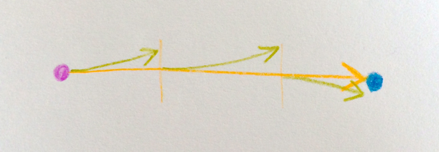

# Why Agile
<!-- Story -->
<!--
Walking to the nearest grocery store from home can be planned in great detail. You’ve done it before and chances are you can just repeat last week’s walk to get there again.

On the other hand, riding your bicycle across town to a friend who has just moved there is slightly more complex. It will require you to make a plan. That’s possible, because you 
-->

> “The 21st century is the age of complexity. It is the century where
> managers realize that, to manage social complexity, they need to
> understand how things grow. Not how they are built.”
> —<em>Jurgen Appelo, Management 3.0</em>

Some journeys cannot be planned in detail. All we know might be the goal, an improvement or experience we wish to achieve. When preparing for such a trip we try to anticipate some possible obstacles as well as resources that may lie on our way. And we will certainly be prepared to halt from time to time and figure out where we are and where to go next.

Likewise, defining a complex product in its details at that exact point in time when we know least about it – the beginning – is an approach that is obviously flawed. Agility therefore means following a _vision_ while continuously _inspecting and adapting_ our path towards that vision.

## Complexity
There exist several models to explain complexity (e. g. [Cynefin] or [Structure-Behavior]). Let’s think of a complex system as a system that can be understood (to some degree) and described (at least in part), but whose behaviour can never be fully predicted, but the relation between cause and effect can only really be understood in retrospect.

Complexity is thus different from chaos, in which prediction and systematic understanding is very limited. Chaotic systems are inherently difficult to manage, impossible to replicate and found, for instance, in research environments.

Complexity is also different from order (or complicatedness), in which cause and effect are directly related. Ordered structures are easy to understand an replicate.

## Linear Thinking
Non adaptive systems behave like ballistic projectiles: once fired, they follow the laws of physics until they reach (or miss) their target. The same thing happens when we separate thinking from doing, as implemented in waterfall project organisations, where implementation has to exactly follow the design created by the architects in the conception phase.

In 1970, Winston W. Royce presented a model for software development ([PDF][WRR-Waterfall]) which is now referred to as _Waterfall Model_. It describes a sequence of development steps from Systems Requirements all the way down to Operations with transitions only between directly neighbouring phases. 

Royce used it to point out how software development cannot work, but to little avail: Until the dawning of the first agile concepts, software development models were based on that same idea: Separating a project into distinct phases, each narrowing the options for all subsequent ones. Almost twenty years in, these ideas are firmly anchored in the majority of organisations including education where software engineering and project management continue to be taught. Consequently, as has been [pointed out recently by Dave Thomas][Time-to-kill-agile] – one of the authors of the Agile Manifesto, so-called agile adoptions or agile transitions are often little more than a new process model replacing an old one.

In this linear model, the most important decisions are taken at the beginning, before the actual learning process starts. Project members who make their contributions later in the process will have to continue walking in the pre-determined direction with little possibility to adapt to changing needs or learning occurred.

## Milestones
As is obvious, the danger of missing such a project’s target exponentially increases with the duration of the project. Big projects therefore have to be planned in more detail than smaller ones which in turn will make them take even longer.

Separating the project into distinct phases will help you detecting deviations from the plan. Milestones are used to define expected outcomes at different points in time during a project. What remains unanswered though is what will happen if the state as defined in the project plan is missed. As planning takes place as a distinct phase at the beginning of the project, adjusting the planning to the new realities is often not an option.

Developers are therefore often pushed to meet the toll gate at any price. Meeting an arbitrary goal that has been set by someone else based on their assumptions, will put anybody’s morale at a tough test. When time runs out, often only work-arounds and quick hacks will help. Technical debt begins to pile up.

## First Step: Iterations
The problem can only be mitigated if the planning is revised after each iteration based on the current state of the product under development _and_ the things learned during development.

In an environment where one architecture phase precedes the coding phase learnings from coding phase _n_ will be possible to implement in phase _n+2_ – if architects are available for that task, and if the necessary changes are possible to incorporate in the existing design. Add _1_ for each additional phase involved (upstream _or_ downstream – compare Royce’s waterfall.) Assume three months for each iteration and your feedback loop will quickly expand over half a year and more. Not what you need for quick learning!

## Handover Cost
<image src="images/externalising-knowledge.png" style="float: right; width: 200px; margin-left: 20px;" />
Running through separate phases sequentially inherently also means having separate experts for each phase, with explicit handovers between phases. At these junctions of the development process, the knowledge gained in the preceding phase (e.g. architecture) must be _formalised_ so it can be absorbed by the people in charge with the following phase (e.g. coding).

Of course what is lost in this situation is all the _tacit_ knowledge that the giver of the handover builds over time. Sometimes [estimated to amount to up to half][Handoff], it comprises all practical experience that has been gained with a topic, as well as most information on what was evaluated or tried and rejected on the way to the final solution.

## Inspect and Adapt
<!-- Crossfunctional Collaboration -->
Agile teams are therefore set up as crossfunctional groups. Ideally co-located at one table, communication is direct and the piece of work is the same for the whole team. All knowledge – technical, process-related or regarding the product itself – is shared between team members continuously as it emerges.

Accordingly, all development phases are united in each iteration of the development process. The result of each iteration is a new increment of the product that has production-level quality and can be deployed to the live system if the team decides they want to.

This way, after each iteration, the team knows _exactly_ about the progress of the project and about the product’s state. Additionally, with each sprint, the team has gained new insights and a better understanding of the problem they are addressing with their development. Based on all this knowledge it can decide what to work on next in order to take another step towards the project goal. We call this _to inspect and adapt_.

With iterations commonly ranging between one and four weeks in Scrum projects, feedback loops get extremely short, allowing for fast learning. The feedback loop will not usually exceed the duration of an iteration, as all specialists are on the team and available to the project for its entire duration.

## Embracing Change
Change doesn’t happen at the inside of a project. Market requirements, available funding, business priorities, competition and many other things often turn a project goal into a moving target. Setting up projects in a way that takes this into accout is therefore imparative in fast-moving markets, as are the web industry and many others.

Also, as Rachel Davis [points out][TAoEC], software is called <em>soft</em>ware for a reason. The rigidity of year-long projects with hardly a chance to react to changing needs or circumstances is against its very nature. Not only will a short-cycled project setup improve things during the development phase, but according to [Conway’s Law][CL], the team’s improved communication will also be reflected in a more adaptive architecture of the resulting product.

> Organizations which design systems … are constrained to produce
> designs which are copies of the communication structures of these organizations
> —M. Conway

<!-- 
## So Why Agile?
-->

[Cynefin]: http://cognitive-edge.com/blog/type/cynefin/ "Cognitive Edge blog"
[Structure-Behavior]: http://www.noop.nl/2010/09/simplicity-a-new-model.html "The Structure-Behavior Model"
[WRR-Waterfall]: http://www.cs.umd.edu/class/spring2003/cmsc838p/Process/waterfall.pdf "Dr. Winston R. Royce, Managing the Development of Large Software Systems"
[Time-to-kill-agile]: http://pragdave.me/blog/2014/03/04/time-to-kill-agile/ "Time to kill agile"
[Handoff]: http://agile.dzone.com/articles/waste-4-handoffs "Waste #4: Handoffs"
[TAoEC]: http://www.slideshare.net/RachelDavies/gotober-keynote-the-art-of-embracing-change "Keynote Slides"
[CL]: http://www.melconway.com/research/committees.html "How Do Committees Invent? by Melvin E. Conway"

<!--
   * Projektmanagement
   * 
      * Planung
      * Messung
      * Aufgabenteilung
      * Zeit–Kosten–Qualität
   * Vergleich mit "sequenzieller" Projektstruktur
   * 
      * Wasserfall
      * V-Modell
   *  Wissensarbeit und Motivation
   * 
      * Drucker, Ackoff, Deming
      * Pink
   * Innovation
   * Grundlagen
      * Komplexe Systeme
      * Pull Scheduling

      * Scientific Management und Industrialisierung
      * 
         * Denken–Ausführen

Agil kann höhere Produktivität bringen, aber das soll das (alleinige) Ziel nicht sein
Agil vs. iterativ vs. Wasserfall (file:///private/var/folders/9x/xkfp8qy115v7f43pbf0mv1tc0000gp/T/calibre_1.0.0_tmp_s8a_t1/Gu5LFJ_ebook_iter/OEBPS/httpatomoreillycomsourceoreillyimages26617.png) vs. (file:///private/var/folders/9x/xkfp8qy115v7f43pbf0mv1tc0000gp/T/calibre_1.0.0_tmp_s8a_t1/Gu5LFJ_ebook_iter/OEBPS/httpatomoreillycomsourceoreillyimages26619.png)

-->